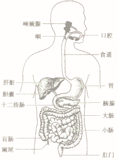
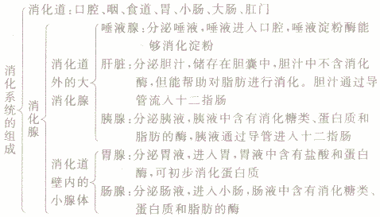

### 前言

开始锻炼身体，于是从豆瓣上搜到一本评价非常高的小册子——《Bigger Leaner Stronger》，因为是英文版的，正好趁着这本书练习一下英语。。嗯，下面是一些笔记，感觉要被各种健身单词虐了 T_T

 ---

### Introduction

在座的都是垃圾，完毕。

### 第一章

很多健身常识都是错误的，错误的原因是因为他们根本就不理解他们说的话，比如：应该记录卡路里、多吃蛋白粉、先有氧再无氧等等。你可以直接问他：

> 什么是卡路里？什么是蛋白质？什么是碳水化合物？

如果一个经常健身的人连这些都不懂，说明他其实并没有掌握基础的健身知识，更别说高级的了。因为这些名词都非常准确，如果你只是通过上下文或者相似的词去猜测它的意思，你和作者表达的意图就差之毫厘谬以千里了。所以，我们要从最基础的关键词开始。

### 第二章

下面是本书中将要使用的名词，说实话，最简单还是去网上找本初中生物看一看：

* Energy，能量：能量是一种能量，它可以从电、燃料、食物和其他资源获得，目的是工作或者产生动作
* Chemistry，化学：自然科学的一个分支，旨在研究物质的组成、分析它们的特征、和它们之间如何相互作用、结合、改变等
* Chemical，化学物品：就是能发生化学反应的物质。**一般情况下，人们所说的化学物品都是人造的，但是定义并不仅仅包括人造的**
* Organism，生物：一个人、一个动物、一个植物，都是生物
* Cell，细胞：是生物的基本组成单元，一些生物仅仅由细胞组成，比如草履虫。但一般来说，一个生物大概有60-100万亿个细胞组成
* Tissue，组织：是动物和植物体内、由大量细胞组成、具有相似形态和功能的结构
* Muscle，肌肉：是由大量组织构成的，紧贴骨头，能通过拉紧和放松让机体产生动作
* Fat，脂肪：是皮肤下面，由天然油性物质或者多余的脂肪性物质构成
* Organ，器官：是生物的一部分，由两个及以上相互协助的组织构成，可提供一些完整的功能。**肌肉不是器官，因为肌肉只是一种组织，而器官最少由两种组织构成**
* Gram，克：计量单位，1磅=454克
* **Calorie，卡路里：是一种计量食物产生多少能量的单位，一卡路里能让1kg 的水提升1摄氏度。所以说到卡路里，就是说食物里面潜在的能量。身体摄入的卡路里，除了维持身体运作和构建肌肉，其他会以脂肪的形式存储**
* Nutrient，营养：是一种提供生物生存和成长的物质，比如水、水果、蔬菜、肉
* Food，食物：不解释
* Matter，物质：宇宙中存在的有质量、有形状的所有东西
* Element，元素或者单质：不能通过化学反应分解为更小的物质，就是元素周期表中的元素
* Compound，化合物：由两种或两种以上的元素组成
* Molecule，分子：是保持物质化学性质的最小粒子
* Acid，酸：化合物，尝起来有酸味
* **Protein，蛋白质：构成人体细胞的基本物质，参与损伤细胞的修复和更新；为人体的生理活动提供能量。肌肉组织含有大量的蛋白质，蛋白质能让人强壮、让骨头更健康，是生命必不可少的营养物质**
* Amino Acid，氨基酸：构成蛋白质
* Carbon，碳：非金属元素，地球上绝大多数物质都含碳，所有生物都含有碳元素
* CarboHydrate，碳水化合物：由碳、氢、氧三种元素组成的化合物
* Metabolism，新陈代谢：食物分解释放能量的过程，这些能量用于为细胞提供能量或者为机体创造更加复杂的分子。当饥饿的时候，机体的新陈代谢会减弱
* Anabolism，合成代谢：就是简单物质合成为复杂的物质
* Catabolism，分解代谢：和上面相反

### 第三章

* Sugar，糖：是一种尝起来有甜味的碳水化合物，它可以来自多种植物，水果，蜜等等。
* Sucrose，蔗糖：是一种糖，常被称为蔗糖，粉末状形式，通过人工和自然方式都可以获得
* Glucose，葡萄糖：是一种非常简单的糖，也是生命体很重要的能量物质。大多数碳水化合物分解后会产生葡萄糖，它也是细胞供能的主要来源
* Glycogen，糖原：是在身体组织中发现的，用于储存碳水化合物的东西。当机体含有额外的葡萄糖，它会存储在肌肉中，这种形式存在的葡萄糖称为糖原。糖原就像身体的后备能源，当身体急需能量时，糖原会将葡萄糖释放到血液中
* Blood Sugar，血糖：血糖水平就是血液中葡萄糖的含量，葡萄糖在血液中传输，释放能量供细胞使用或储存
* Simple CarboHydrate，简单碳水化合物：是一种非常简单的糖，能非常迅速的分解为葡萄糖
* Complex CarboHydrate，复杂碳水化合物：就是由多种简单碳水化合物组成的，所以分解起来会比较慢
* Starch，淀粉：复杂碳水化合物，一种粉末状物质，是人体非常重要的能量物质，虽然淀粉是一种复杂碳水化合物，但是许多富含淀粉的物质却能迅速分解为葡萄糖
* Insulin，胰岛素：由蛋白质构成，在胰腺中合成。胰岛素就是让细胞吸收血液中的葡萄糖，降低血糖水平。然后可以了解一下糖尿病是怎么回事
* Glygemic Index，血糖指数（GI）：是衡量不同碳水化合物在人体内的血糖水平的单位，碳水化合物分解慢的，释放到血液中的葡萄糖也会比较慢，血糖指数就低；反之则高；**GI 小于55认为低，高于70认为高，纯净葡萄糖的 GI 为100**
* Grain，谷物：是不同种类草的种子，也可作为食物。谷物常加工为粉末状的面粉
* Wheat，小麦：小麦是一种产生谷粒的植物，常用于制作面包和意大利面
* White Bread，白面包：是一种面包，它由将部分谷物去掉且经过漂白的小麦面粉制作而成，这样会更容易烘焙和保存。是简单碳水化合物
* Whole Grain，全麦：就是没有去掉部分谷物，是复杂碳水化合物
* Fiber，纤维素：是一种在谷物、水果、蔬菜中发现的，不能被人体消化的物质。它可以吸收水分，并帮助将无用的食物排出体外，防止这些食物存在于消化系统并堵塞消化系统。纤维素被认为在防止消化疾病中扮演了一个很重要的角色。
* Fatty Acids，脂肪酸：组成脂肪的分子，用于帮助构建部分细胞和组织。脂肪酸含有两倍于碳水化合物和蛋白质的能量，所以脂肪酸多用于在脂肪组织储存能量
* Oil，油：是一种常温下以液体形式存在的脂肪，摸起来比较滑，而且不能和水融合。橄榄油、植物油、花生油都是食用油
* Essential Fatty Acids，必不可少的脂肪酸：有些脂肪酸是许多重要人体功能锁需要的物质，可以从植物油或者鱼类中获取。比如芝麻种子、南瓜子、胡桃等

嗯，虽然看过了这么多定义。但是都是分散的、没有系统性的。所以，我在网上 google 了初中生物，并且在 youtube 上观看了很多关于消化的视频，在这里做个总结吧。

### 第三章 —— 番外篇

说营养，首先要说先人体的七大营养素。他们是：

* 糖类(组成细胞的主要有机物)：人体内主要的供能物质
* 脂类(组成细胞的主要有机物)：这个分两类，一个是脂肪，也就是我们最深恶痛绝的；另一个是类脂，身体里的大部分激素是类脂，包括合成代谢类固醇也属于类脂的范畴
* 蛋白质(组成细胞的主要有机物)：这是你能进行生命活动的关键物质，为生长发育以及受损细胞的修复和更新提供原料。蛋白质也能供能，但效率很低
* 水：细胞的主要组成成分，人体60%-70%都是水，营养物质流动、代谢废物运输只有溶于水才能运输
* 无机盐：比如含钙的、含磷的、含锌的、含碘的无机盐，无机盐在体内的含量不大，但作用却很大
* 维生素：人体需求量少，因为它不是构成细胞的主要原料，不能供能，但生命活动又必不可少的物质。普遍存在于水果和蔬菜中，比如重要的维生素 C，没有它就容易得败血症
* 膳食纤维：除淀粉以外复杂的糖类，包括纤维素、果胶等。是植物细胞细胞壁的组成部分。大量存在于蔬菜瓜果、海藻、粮食（主要是粗粮）中。但是人体消化不了这东西，因为没有对应的微生物（牛羊等食草类动物有）。膳食纤维主要是帮助胃肠蠕动，防止便秘，也能促进有害物质排出体外，对预防大肠癌、高血脂、高血糖、心脑血管疾病、糖尿病等有一定作用

三大产能营养素的消化：

* 口腔：淀粉——淀粉酶——麦芽糖——麦芽糖酶——葡萄糖
* 胃：蛋白质——蛋白酶——多肽——肽酶——氨基酸
* 小肠：脂肪——胆汁——脂肪微粒——脂肪酶——甘油 + 脂肪酸

科学研究证明，脂肪和蛋白质在口腔中不能被消化，只有淀粉在唾液淀粉酶的作用下，部分转化为麦芽糖。而又因为淀粉没有甜味、麦芽糖有甜味，所以像米饭、馒头等嚼久了，就会感觉有一丝丝甜味。当然，麦芽糖不能直接被人体吸收，所以口腔只需有初步的消化作用。那么，什么是消化呢？

> 食物中的淀粉、脂肪和蛋白质都是分子大、结构复杂的有机物，进入消化系统后，逐步分解为简单的物质才能被人体吸收，这个过程叫做消化。**消化系统由消化道和消化腺组成。**消化主要是通过多种消化酶的作用而进行的，除口腔中的唾液淀粉酶以外，胃、小肠等器官中还有许多种消化酶。

#### 消化道：

1. 口腔：口腔是消化道的开始部位，里面有牙齿、舌和唾液腺。牙齿的主要功能是切断、撕裂和磨碎食物，牙齿损伤以后，食物就不能得到充分的咀嚼，因而会加重胃、肠的负担。
2. 咽：是食物和空气的共同通道，无消化和吸收能力。
3. 食道：是物物进入体内的通道，可以蠕动将食物推入胃。
4. 胃：位于腹腔的左上方，是消化道最膨大的部分。胃呈囊状结构，由外至里依次由浆膜，肌肉层、黏膜下层，黏膜4层绀成，黏膜具有腺体，能分泌盐酸和胃蛋白酶等
胃具有暂时储存食物并蠕动进行物理性消化．以及利用盐酸、蛋白酶对食物进行化学性消化的作用。
5. 小肠：小肠盘曲在腹腔里，长约5～6米，开始的一段叫十二指肠。小肠是消化道中最长的段，是消化食物和吸收营养物质的主要场所。小肠壁也分为4层，与胃壁相似。小肠黏膜的表面有许多环形皱襞，皱襞上有许多绒毛状的突起——小肠绒毛(如图)。小肠绒毛间的黏膜凹陷形成肠腺，可以分泌肠液消化食物。小肠内表面具有的皱襞和小肠绒毛，大大地增加了消化食物和吸收营养物质的面积、小肠绒毛中有毛细血管和毛细淋巴管。小肠绒毛壁、毛细血管壁和毛细淋巴管壁都很薄，都只由一层上皮细胞构成。这种结构特点有利于吸收营养物质。
6. 大肠：大肠开始的一段叫盲肠，盲肠上有一细小突起叫阑尾，肓肠位于腹腔右下部，所以患阑尾炎时．右下腹部疼痛。大肠无消化能力，但有较弱的吸收能力，能吸收少量的水、无机盐和部分维生素。
7. 肛门：未消化的食物残渣在大肠内形成粪便，由肛门排到体外。

#### 消化腺：

人体出的消化腺包括唾液腺、胃腺、肝脏、胰腺和肠腺。其中，唾液腺、肝脏和胰腺是位于消化道外的消化腺，胃腺和肠腺是位于消化道壁内的腺体。

1. 唾液腺：唾液腺能分泌唾液，唾液的主要作用是湿润口腔和食物，便于吞咽；唾液中含有的唾液淀粉酶，能促使一部分淀粉分解为麦芽糖；唾液中含有的溶菌酶有一定的杀菌作用。
2. 胃腺：胃腺是由胃壁内黏膜上皮凹陷而形成的，胃腺开口在胃壁的内表面。胃腺能分泌胃液。胃液呈酸性，pH为0．9～1．5，成人每天分泌的胃液为1．5～2．5升。胃液的主要成分有胃蛋白酶、盐酸(即胃酸)和黏液。
3. 肝脏：肝脏是人体内最大的腺体，成人的肝重约1．5千克，大部分位于腹腔的右上部。肝脏具有多方两的生理功能。肝脏在蛋白质、糖类和脂肪的代谢中起着重要作用。肝脏还具有解毒功能。肝脏能够分泌胆汁，并将其储存在胆囊内。当食物进入口腔、胃和小肠时，可以反射性地引起胆囊收缩，胆汁经过总胆管流入十二指肠。成人每天分泌的胆汁约为0．8～1．0升。胆汁中没有消化酶，主要成分是胆盐和胆色素。胆盐的作用是激活胰脂肪酶，将脂肪乳化成极细小的微粒，增加脂肪与胰脂酶的接触面积，有利于脂肪的消化和吸收；可以与脂肪酸和脂溶性维生素结合，形成水溶性复合物，以促进人体对这些物质的吸收。
4. 胰腺：胰腺分泌胰液，胰液呈碱性，pH为7．8～8．4，成人每天分泌的胰液约为l～2升。胰蛋白酶作用于蛋白质，蛋白质被分解为多肽和少量氨基酸。存在于胰液中的胰淀粉酶和少量的胰麦芽糖酶，又可以分别促使淀粉和麦芽糖分解为葡萄糖。胰脂肪酶在胆汁的协同作用下，促使脂肪分解为脂肪酸和甘油。肠腺是有由小肠壁内黏膜上皮凹陷而形成的，开口于相邻的两个小肠绒毛之间。肠腺能分泌肠液，肠液呈弱碱性，pH约为7．6，成人每天分泌的肠液为1～3升。肠液内含有多种消化酶，如淀粉酶、麦芽糖酶、蔗糖酶、乳糖酶、肽酶、脂肪酶等，通过这些酶的作用，进一步分解糖类，蛋白质和脂肪，使之成为可以吸收的物质。

然后推荐一个讲解消化系统的视频，巨搞笑，不过讲的还真挺好的：[消化](https://www.youtube.com/watch?v=qE5_jtH1z7c)

### 第四章

